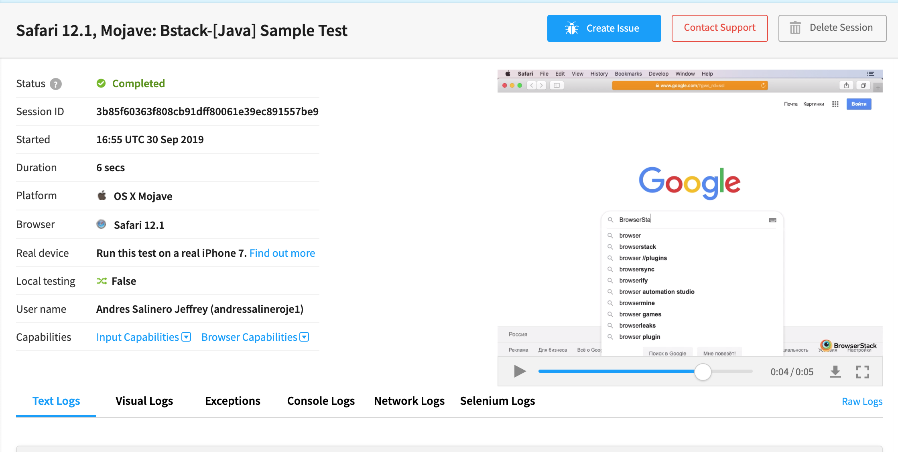
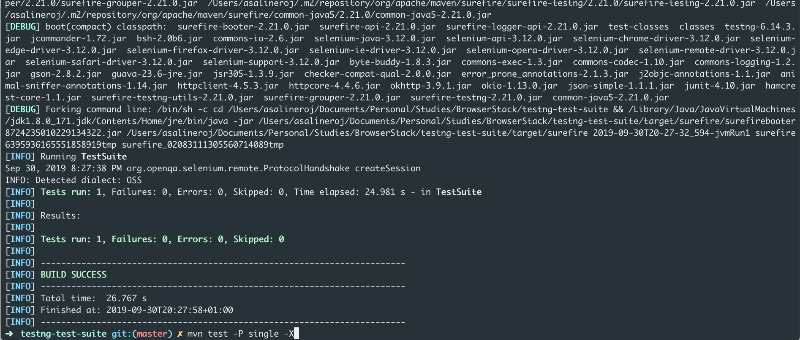
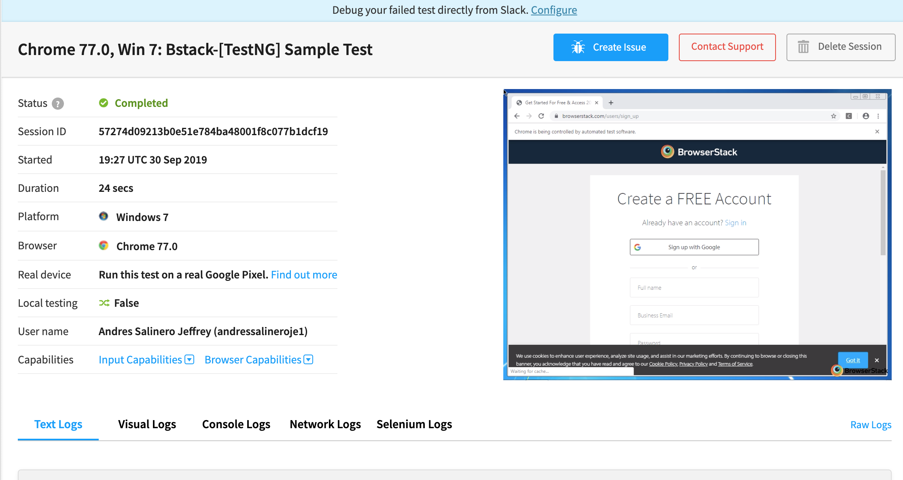
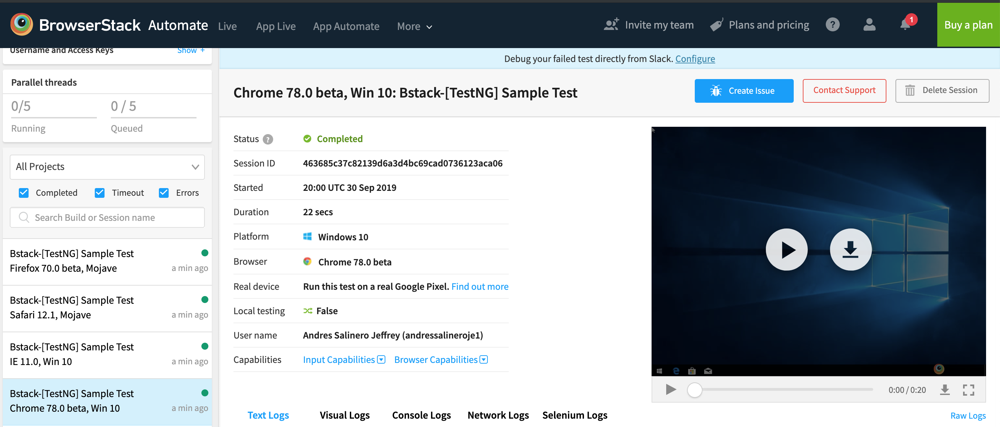
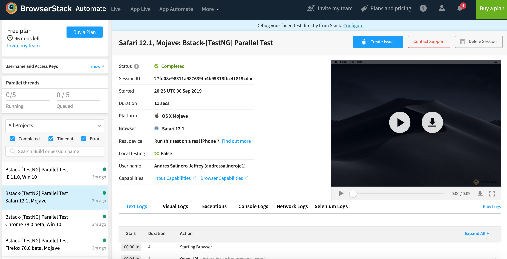

# 1. Check Selenium dependency is in the pom

# 2. Following the guide for Java (https://www.browserstack.com/automate/java)

No need to add the Selenium Java bindings, done through Maven and setting the dependency in the pom
		
# 3. add the Java sample class to the project and test.

View result on the console and on BrowserStack Dashboard (https://automate.browserstack.com/dashboard)
 
image console:


 	
image dashboard:

 	

My first automated test!

# 4. Following the Selenium with TestNG guide (https://www.browserstack.com/automate/testng)
	
Create Test Resource folder to hold test configuration files and file for single test
    Update single.testng.xml file with config and environment parameters
    run maven profile for single test:

```
	mvn test -P single
```

 

And the result in BrowserStack's Dashboard:



Setup the configuration for the different OS-browser combinations, we can get these from (https://www.browserstack.com/automate/capabilities) which includes a Capability Generator, and run tests for each configuration:




Now to speed up testing and making the most of Selenium's scaling:

We set up the configuration with all the different environments to test in.
 1. parallel.testng.xml
 2. parallel.conf.json 

We finally create a Maven profile to execute the test using the parallel configurations

and we run the test in parallel by executing:
```
	mvn test P parallel
```

Check results on BrowserStack's Dashboard


